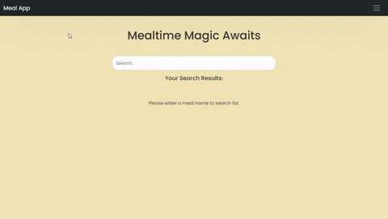

[Meal App Logo]

#

The Meal App is a web application that allows users to search for meals and explore various recipes. It provides a user-friendly interface to discover delicious meal ideas and save favorite recipes for quick access.

## Table of Contents
- [Features](#features)
- [Preview](#preview)
- [Installation](#installation)
- [Usage](#usage)
- [Technologies Used](#technologies-used)
- [Contributing](#contributing)
- [License](#license)

## Features

- Search for meals by name
- Interactive meal cards with images and details
- View meal details, including category, area, and cooking instructions
- Watch recipe videos for selected meals
- Add and remove meals from favorites list

## Preview

## Installation

1. Clone the repository: `git clone git clone https://github.com/WhoisMonesh/MealAPP.git`
2. Navigate to the project directory: `cd meal-app`
3. Install dependencies: _(Add instructions for installing any dependencies, if applicable)_

## Usage

1. Open `index.html` in your web browser.
2. Use the search bar to find meals by name.
3. Click on a meal card to view more details.
4. Add meals to your favorites list by clicking the heart button on a meal card.
5. Access your favorite meals by clicking the "Favourites" button in the navigation bar.

## Technologies Used

- HTML
- CSS (Bootstrap)
- JavaScript
- External APIs (e.g., TheMealDB API)

## Contributing

Contributions are welcome! If you find a bug or have any suggestions, feel free to open an issue or submit a pull request.

## License

The Meal App is open-source software licensed under the [MIT License](LICENSE).

---

_This project was created by [Monesh Ram](https://github.com/WhoisMonesh)._ 
